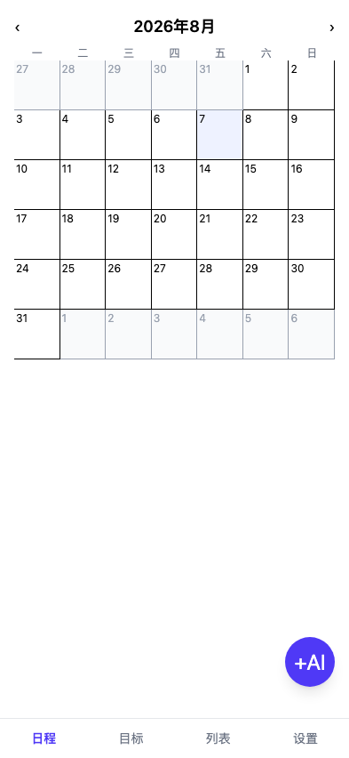
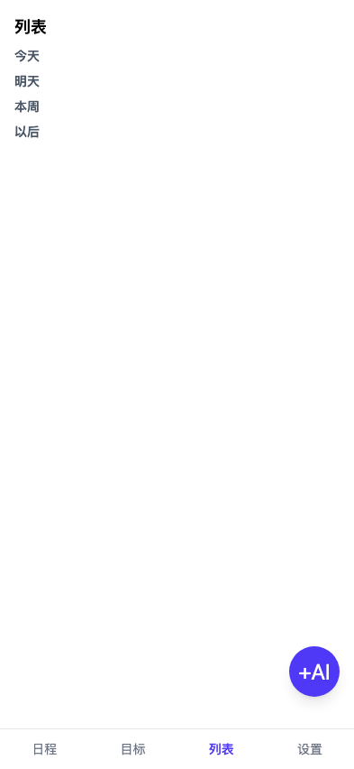

# 日规 rigui

移动端优先的 AI 日程计划 PWA。说一句「下周二下午3点和老王开会」，自动生成日程——时间、地点、重复、提醒都解析好，确认即入库。

- 自然语言创建日程（OpenAI 兼容 API，数据仅存本地）
- **AI 对话首页**：多轮对话管理日程——建/查/改/删日程、目标排期、周报小结，写操作经预览确认，对话记录本地持久化
- 月/周/日/列表视图（对话页旁的「日程」入口），冲突检测
- 目标驱动排期：目标拆解为任务（各自每周次数/时长），一键排满未来一周空闲时段，删除级联清理
- AI 智能周报：月视图本周简报——完成率、目标/任务进度、时间分布、空闲与冲突分析，可一键生成 AI 总结
- Web 通知提醒（前台调度约 30s 触发；Service Worker 处理通知点击）；周报自动推送（每周日可自定义时间/开关）
- ICS 导出（兼容 Apple/Google 日历）、JSON 备份导入导出
- 桌面应用（Electron）：独立窗口、系统通知、保存对话框，`npm run build:app` 打包 .app/.dmg
- 液态玻璃 UI（Apple Liquid Glass 风格）：暖色极光墙纸 + 高光带/渐变边缘光玻璃面板 + 指针跟随光泽 + 弹性动效（月视图格子轻 blur 变体控制性能）

## Screenshots / 演示

| 月视图 / Month | 列表视图 / List |
|---|---|
|  |  |

## 快速开始

```bash
npm install
npm run dev
```

浏览器打开后：设置页填入 API 地址 / Key / 模型（支持任意 OpenAI 兼容端点：DeepSeek、OpenAI、本地 vLLM 等）。

## 桌面应用（Electron）

同一套代码可打包为 macOS / Windows / Linux 桌面应用，数据仍存本地 IndexedDB（位于系统应用数据目录）。

```bash
npm run dev:app   # 开发：vite 热更新 + Electron 窗口
npm run build:app # 打包当前平台安装包（macOS 产出 release/日规.dmg）
```

- 通知走系统通知（窗口最小化也能收到，点击聚焦窗口）；退出应用后无后台提醒
- ICS / JSON 导出弹系统保存对话框
- 跨平台打包：`npx electron-builder --win` / `--linux`
- 分发提示：本地打包未签名，首次启动需右键「打开」；对外分发需 Apple Developer 证书签名/公证

## 技术栈

Vite / React 19 / TypeScript / Tailwind 4 / Dexie(IndexedDB) / vite-plugin-pwa / Electron

## 开发

```bash
npm test          # 单元测试
npm run test:e2e  # E2E（mock LLM）
npm run perf      # 性能基准（blur 层预算 / FPS / longtask）
npm run lint && npm run build
```

## Verification / 验证

```bash
npm ci
npm run lint
npm test
npm run build
npm run test:e2e
```

E2E 使用 mock LLM；Pull Request 上的 CI 应保持绿色。性能相关改动另运行 `npm run perf`。

## Current status / 当前状态

- 定位：local-first AI scheduling / planning product。
- 已实现自然语言日程、冲突检测、目标/任务自动排期、周报、通知、备份、PWA 和 Electron 桌面端。
- 当前进入稳定化阶段，优先数据可靠性、提醒行为、跨平台打包和导入导出兼容。

## Roadmap / 路线图

- ✅ v1：自然语言创建 + 冲突检测 + 四视图 + 通知 + 导出
- ✅ v2：目标驱动自动排期（目标卡 + 排期一周 + 级联删除）
- ✅ v3：智能分析（AI 周报）
- 后续重点：解析准确性、自动排期可解释性、通知可靠性、备份恢复、桌面端稳定性和 Release 流程。
- 不无节制扩张新的规划系统；新增能力应先证明能改善既有日程工作流。

## Limitations / 限制

- 日程和设置默认存储在本地 IndexedDB；跨设备同步目前依赖 JSON/ICS 导入导出。
- Web 通知依赖浏览器运行状态和操作系统权限；退出桌面应用后不会继续后台提醒。
- 自然语言解析和 AI 周报依赖用户配置的第三方 provider，其可用性、成本与数据政策不由本项目控制。
- Electron 分发包默认未签名；公开分发前需要对应平台的签名与公证。

安全边界和漏洞报告方式见 [SECURITY.md](SECURITY.md)。

## License

MIT
